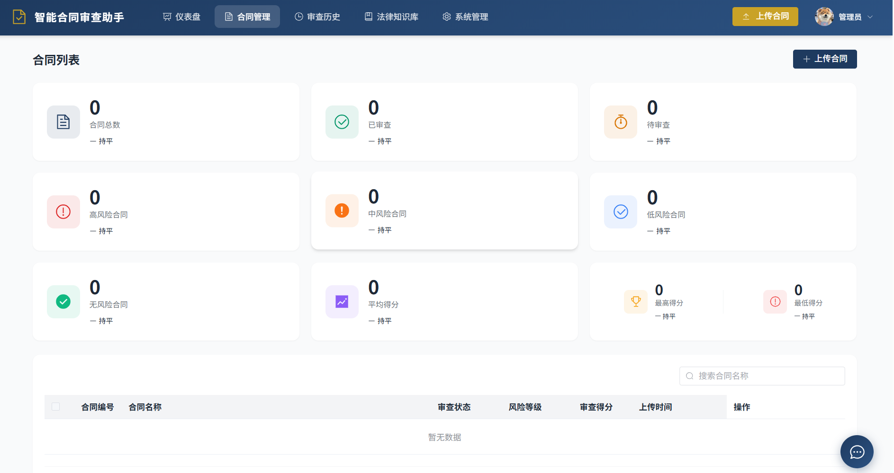
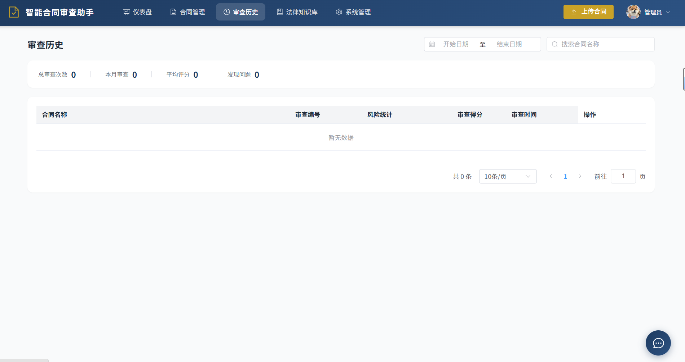
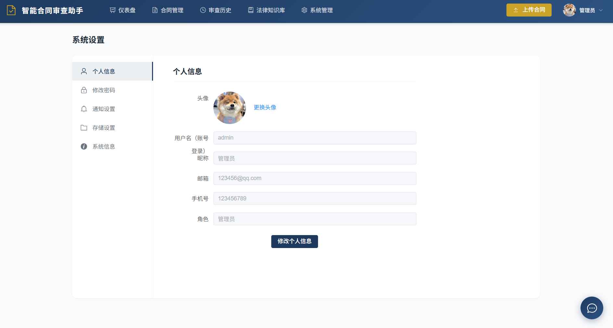

# 智能合同审查助手 (Contract Review AI Assistant)


[English Version](README_ENGLISH.md) | [架构说明](ARCHITECTURE.md)

## 📋 项目概述

智能合同审查助手是一款基于人工智能的企业法务合规解决方案，通过 AI 自动审查合同文档，识别风险条款、缺失条款、违规条款，关联相关法律法规，输出专业审查报告，大幅降低法务工作量，提升企业合同合规性。

### ✨ 核心功能

- **智能合同审查**: 自动解析 PDF/DOCX 合同文档，识别风险条款
- **法律知识库**: RAG 检索增强，关联相关法律法规和司法解释
- **实时进度推送**: SSE 技术实现审查进度实时更新
- **多格式报告**: 自动生成 Word/PDF 格式的审查报告
- **智能客服**: 集成 AI 聊天助手，解答法律相关问题
- **用户管理**: 完整的 RBAC 权限控制系统
- **通知系统**: 邮件和系统通知机制

### 🎯 适用场景

- 企业法务部门合同审查
- 律师事务所合同分析
- 金融机构合规检查
- 电商平台商家合同审核

## 📸 界面展示（部分）

<table>
  <tr>
    <td align="center"><b>合同管理</b></td>
    <td align="center"><b>审查历史</b></td>
  </tr>
  <tr>
    <td></td>
    <td></td>
  </tr>
  <tr>
    <td align="center" colspan="2"><b>系统设置</b></td>
  </tr>
  <tr>
    <td colspan="2" align="center"></td>
  </tr>
</table>

## 🏗️ 系统架构

### 三层架构设计

```
┌─────────────────────────────────────────────────────────────┐
│                       前端层 (Vue.js)                        │
│                    http://localhost:3000                    │
└──────────────────────────────┬──────────────────────────────┘
                               │
┌──────────────────────────────▼──────────────────────────────┐
│                 SpringBoot 网关层 (Java)                    │
│                    http://localhost:8080                    │
│                   统一认证、授权、API 路由                   │
└──────────────────────────────┬──────────────────────────────┘
                               │
┌──────────────────────────────▼──────────────────────────────┐
│                FastAPI AI 服务层 (Python)                   │
│                    http://localhost:8001                    │
│               合同解析、风险分析、AI 推理                   │
└─────────────────────────────────────────────────────────────┘
```

### 技术栈

| 组件 | 技术栈 | 说明 |
|------|--------|------|
| **前端** | Vue 3 + Element Plus + Vite + Pinia | 现代化单页应用，响应式设计 |
| **API 网关** | Spring Boot 4.0.5 + MyBatis + MySQL + Redis | 业务逻辑处理、数据持久化 |
| **AI 服务** | FastAPI + LangChain + DashScope + RAG | AI 模型推理、向量检索 |
| **数据库** | MySQL 8.0 + Redis 7.0 | 关系数据 + 缓存/会话管理 |
| **文件存储** | 本地存储 / 阿里云 OSS | 合同文档存储 |
| **向量数据库** | Chroma / FAISS | 法律知识库向量检索 |
| **数据库迁移** | Alembic | SQLAlchemy 数据库版本管理 |
| **服务监控** | 自定义健康检查 | /ready 接口、连接池监控 |

## 🚀 快速开始

### 环境要求

- **JDK**: 25+
- **Python**: 3.9+
- **Node.js**: 18+
- **MySQL**: 8.0+
- **Redis**: 7.0+

### 1. 克隆项目

```bash
git clone <repository-url>
cd 合同审查agent
```

### 2. 数据库初始化

```bash
# 创建 MySQL 数据库
mysql -u root -p -e "CREATE DATABASE contract_review CHARACTER SET utf8mb4 COLLATE utf8mb4_unicode_ci;"

# 执行初始化脚本（如果有）
mysql -u root -p contract_review < docs/database/init.sql
```

### 3. 后端服务启动 (SpringBoot)

```bash
cd ContractReview

# 配置数据库
# 修改 src/main/resources/application.yml 中的数据库连接信息

# 启动服务
mvn spring-boot:run
# 或
mvn clean package -DskipTests
java -jar target/ContractReview-0.0.1-SNAPSHOT.jar
```

服务启动后访问：http://localhost:8080/api

### 4. AI 服务启动 (FastAPI)

```bash
cd 合同审查

# 创建虚拟环境（推荐）
python -m venv venv
# Windows
venv\Scripts\activate
# Linux/Mac
source venv/bin/activate

# 安装依赖
pip install -r requirements.txt

# 配置环境变量
cp .env.example .env
# 编辑 .env 文件，设置 API 密钥等

# 启动服务
python -m uvicorn app.main:app --host 0.0.0.0 --port 8001 --reload
```

服务启动后访问：http://localhost:8001/docs

#### Alembic 数据库迁移（可选）

如果使用 Alembic 管理数据库迁移：

```bash
# 生成迁移脚本（根据模型变化自动生成）
alembic revision --autogenerate -m "create contract table"

# 查看当前版本
alembic current

# 升级到最新版本
alembic upgrade head

# 降级到上一个版本
alembic downgrade -1

# 查看历史版本
alembic history
```

### 5. 前端启动

```bash
cd frontend

# 安装依赖
npm install

# 配置 API 地址
# 修改 .env 文件中的 VITE_API_BASE_URL

# 启动开发服务器
npm run dev
```

### 6. 访问应用

- **前端界面**: http://localhost:3000
- **SpringBoot API**: http://localhost:8080/api
- **FastAPI API**: http://localhost:8001/api/v1
- **API 文档**: http://localhost:8080/swagger-ui.html
- **健康检查**: http://localhost:8001/ready (服务就绪状态)

## 📁 项目结构

```
合同审查agent/
├── frontend/                    # Vue 3 前端项目
│   ├── src/
│   │   ├── api/               # API 接口
│   │   ├── assets/            # 静态资源
│   │   ├── components/        # 组件
│   │   ├── router/            # 路由配置
│   │   ├── store/             # Pinia 状态管理
│   │   └── views/             # 页面视图
│   ├── package.json
│   └── vite.config.js
│
├── ContractReview/             # SpringBoot 后端项目
│   ├── src/main/java/com/example/contractreview/
│   │   ├── config/           # 配置类
│   │   ├── controller/       # 控制器
│   │   ├── service/          # 业务服务
│   │   ├── mapper/           # 数据访问
│   │   ├── entity/           # 实体类
│   │   └── utils/            # 工具类
│   ├── src/main/resources/
│   │   ├── application.yml   # 主配置文件
│   │   └── mapper/           # MyBatis XML
│   └── pom.xml
│
├── 合同审查/                   # Python AI 服务
│   ├── app/
│   │   ├── api/              # API 路由
│   │   ├── core/             # 核心配置
│   │   ├── models/           # 数据模型
│   │   ├── services/         # 业务逻辑
│   │   └── utils/            # 工具函数
│   ├── requirements.txt
│   └── main.py
│
├── docs/                      # 项目文档
│   ├── API文档.md
│   ├── 部署指南.md
│   └── 架构设计.md
│
└── README.md                  # 本文档
```

## 🔧 配置说明

### SpringBoot 配置 (`application.yml`)

```yaml
server:
  port: 8080
  servlet:
    context-path: /api

spring:
  datasource:
    url: jdbc:mysql://localhost:3306/contract_review?useUnicode=true&characterEncoding=utf8&serverTimezone=Asia/Shanghai
    username: root
    password: your_password
    driver-class-name: com.mysql.cj.jdbc.Driver
  
  redis:
    host: localhost
    port: 6379
    database: 0
    password: 
    timeout: 6000ms

# FastAPI 服务配置
fastapi:
  base-url: http://localhost:8001
  api-prefix: /api/v1
  timeout: 30000
  connect-timeout: 5000

# 文件上传配置
upload:
  max-file-size: 50MB
  allowed-types: pdf,docx,doc
  storage-path: ./uploads
```

### FastAPI 配置 (`.env`)

```env
# 应用配置
APP_NAME=Contract Review AI Service
APP_VERSION=1.0.0
APP_DEBUG=false

# 服务器配置
HOST=0.0.0.0
PORT=8001

# API配置
API_PREFIX=/api/v1

# 安全配置
SECRET_KEY=your-secret-key-here
ACCESS_TOKEN_EXPIRE_MINUTES=30

# CORS配置
BACKEND_CORS_ORIGINS=["http://localhost:3000", "http://localhost:8080"]

# 模型配置
DASHSCOPE_API_KEY=your_dashscope_api_key
LLM_MODEL_DEFAULT=qwen3.6-flash
LLM_MODEL_REVIEW=qwen3.6-flash
EMBEDDING_MODEL=BAAI/bge-small-zh-v1.5
EMBEDDING_TYPE=huggingface

# 数据库配置
MYSQL_HOST=localhost
MYSQL_PORT=3306
MYSQL_USER=root
MYSQL_PASSWORD=your_password
MYSQL_DB=contract_review

# Redis 配置
REDIS_HOST=localhost
REDIS_PORT=6379
REDIS_PASSWORD=
REDIS_DB=0

# 向量数据库配置
VECTOR_STORE_PATH=./vector_store
CHROMA_PERSIST_DIRECTORY=./chroma_db

# 文件存储配置
UPLOAD_DIR=./uploads
MAX_FILE_SIZE=52428800
```

### 前端配置 (`.env`)

```env
# 开发环境
VITE_API_BASE_URL=http://localhost:8080/api
VITE_AI_API_URL=http://localhost:8001/api/v1

# 生产环境（部署时修改）
# VITE_API_BASE_URL=https://your-domain.com/api
# VITE_AI_API_URL=https://your-domain.com/ai/api/v1
```

## 📊 数据库设计

### 核心表结构

| 表名 | 说明 |
|------|------|
| `sys_user` | 用户信息表 |
| `contract` | 合同信息表 |
| `review_task` | 审查任务表 |
| `risk_item` | 风险项表 |
| `report` | 报告信息表 |
| `law_regulation` | 法律法规表 |
| `law_article` | 法条表 |
| `contract_template` | 合同模板表 |
| `sys_operation_log` | 操作日志表 |
| `chatbot_conversation` | 对话记录表 |
| `notification` | 通知消息表 |

详细数据库设计见 [后端开发文档.md](后端开发文档.md)

## 🐳 Docker 部署

### 环境变量配置

生产环境部署时，请通过环境变量配置所有敏感信息，**不要**将密码等敏感信息硬编码到配置文件中。

#### 必需的环境变量

| 类别 | 变量名 | 说明 | 示例 |
|------|--------|------|------|
| **数据库** | `DB_URL` | MySQL连接URL | `jdbc:mysql://mysql:3306/contract_review?useUnicode=true&characterEncoding=utf-8&useSSL=true&serverTimezone=Asia/Shanghai` |
| | `DB_USERNAME` | 数据库用户名 | `contract_user` |
| | `DB_PASSWORD` | 数据库密码 | `your-secure-password` |
| **Redis** | `REDIS_HOST` | Redis服务器地址 | `redis` |
| | `REDIS_PORT` | Redis端口 | `6379` |
| | `REDIS_PASSWORD` | Redis密码 | `your-redis-password` |
| | `REDIS_DATABASE` | Redis数据库索引 | `0` |
| **JWT** | `JWT_SECRET` | JWT签名密钥（至少32位） | `your-256-bit-secret-key-here-must-be-long-enough` |
| **邮件** | `MAIL_HOST` | SMTP服务器地址 | `smtp.qq.com` |
| | `MAIL_PORT` | SMTP端口 | `465` |
| | `MAIL_USERNAME` | 邮箱账号 | `your-email@qq.com` |
| | `MAIL_PASSWORD` | 邮箱授权码/密码 | `your-app-password` |
| **FastAPI** | `FASTAPI_BASE_URL` | FastAPI服务地址 | `http://fastapi:8001` |
| **OSS** | `OSS_ENDPOINT` | OSS服务端点 | `oss-cn-beijing.aliyuncs.com` |
| | `OSS_BUCKET` | OSS存储桶名称 | `your-bucket-name` |
| | `OSS_REGION` | OSS区域 | `cn-beijing` |
| | `OSS_ACCESS_KEY_ID` | 阿里云AccessKey ID | `your-access-key-id` |
| | `OSS_ACCESS_KEY_SECRET` | 阿里云AccessKey Secret | `your-access-key-secret` |

### 方式一：Docker Compose 部署（推荐）

#### 1. 创建环境变量文件

创建 `.env` 文件：

```bash
# 数据库配置
DB_URL=jdbc:mysql://mysql:3306/contract_review?useUnicode=true&characterEncoding=utf-8&useSSL=true&serverTimezone=Asia/Shanghai
DB_USERNAME=contract_user
DB_PASSWORD=your_secure_db_password

# Redis配置
REDIS_HOST=redis
REDIS_PORT=6379
REDIS_PASSWORD=your_secure_redis_password
REDIS_DATABASE=0

# JWT配置
JWT_SECRET=your-256-bit-secret-key-here-must-be-long-enough-for-security

# 邮件配置
MAIL_HOST=smtp.qq.com
MAIL_PORT=465
MAIL_USERNAME=your-email@qq.com
MAIL_PASSWORD=your-app-password

# FastAPI配置
FASTAPI_BASE_URL=http://fastapi:8001

# OSS配置
OSS_ENDPOINT=oss-cn-beijing.aliyuncs.com
OSS_BUCKET=your-bucket-name
OSS_REGION=cn-beijing
OSS_ACCESS_KEY_ID=your-access-key-id
OSS_ACCESS_KEY_SECRET=your-access-key-secret
```

#### 2. 启动服务

```bash
# 克隆项目
git clone <repository-url>
cd 合同审查agent

# 启动所有服务
docker-compose up -d

# 查看日志
docker-compose logs -f

# 停止服务
docker-compose down
```

### Docker Compose 配置

```yaml
version: '3.8'

services:
  mysql:
    image: mysql:8.0
    container_name: contract-mysql
    environment:
      MYSQL_ROOT_PASSWORD: ${MYSQL_ROOT_PASSWORD:-root123}
      MYSQL_DATABASE: contract_review
      TZ: Asia/Shanghai
    ports:
      - "3306:3306"
    volumes:
      - mysql_data:/var/lib/mysql
      - ./docs/database/init.sql:/docker-entrypoint-initdb.d/init.sql
    command: --default-authentication-plugin=mysql_native_password
    networks:
      - contract-network

  redis:
    image: redis:7.0-alpine
    container_name: contract-redis
    ports:
      - "6379:6379"
    volumes:
      - redis_data:/data
    networks:
      - contract-network

  springboot:
    build: 
      context: ./ContractReview
      dockerfile: Dockerfile
    container_name: contract-java
    ports:
      - "8080:8080"
    environment:
      SPRING_PROFILES_ACTIVE: prod
      SPRING_DATASOURCE_URL: jdbc:mysql://mysql:3306/contract_review?useUnicode=true&characterEncoding=utf8
      SPRING_DATASOURCE_USERNAME: root
      SPRING_DATASOURCE_PASSWORD: ${MYSQL_ROOT_PASSWORD:-root123}
      SPRING_REDIS_HOST: redis
      SPRING_REDIS_PORT: 6379
      FASTAPI_BASE_URL: http://fastapi:8001
    depends_on:
      - mysql
      - redis
    networks:
      - contract-network

  fastapi:
    build: 
      context: ./合同审查
      dockerfile: Dockerfile
    container_name: contract-python
    ports:
      - "8001:8001"
    environment:
      MYSQL_HOST: mysql
      MYSQL_PORT: 3306
      MYSQL_USER: root
      MYSQL_PASSWORD: ${MYSQL_ROOT_PASSWORD:-root123}
      MYSQL_DB: contract_review
      REDIS_HOST: redis
      REDIS_PORT: 6379
      DASHSCOPE_API_KEY: ${DASHSCOPE_API_KEY}
    volumes:
      - ./uploads:/app/uploads
      - ./vector_store:/app/vector_store
    depends_on:
      - mysql
      - redis
    networks:
      - contract-network

  nginx:
    image: nginx:alpine
    container_name: contract-nginx
    ports:
      - "80:80"
    volumes:
      - ./nginx.conf:/etc/nginx/nginx.conf
      - ./frontend/dist:/usr/share/nginx/html
    depends_on:
      - springboot
      - fastapi
    networks:
      - contract-network

volumes:
  mysql_data:
  redis_data:

networks:
  contract-network:
    driver: bridge
```

### 方式二：传统服务器部署（Linux Systemd）

#### 1. 创建服务配置文件

创建 `/etc/systemd/system/contract-review.service`：

```ini
[Unit]
Description=Contract Review System
After=network.target

[Service]
Type=simple
User=contract
WorkingDirectory=/opt/contract-review
ExecStart=/usr/bin/java -jar contract-review.jar
Restart=always
RestartSec=10

# 环境变量
Environment="DB_URL=jdbc:mysql://localhost:3306/contract_review?useUnicode=true&characterEncoding=utf-8&useSSL=true&serverTimezone=Asia/Shanghai"
Environment="DB_USERNAME=contract_user"
Environment="DB_PASSWORD=your_secure_db_password"
Environment="REDIS_HOST=localhost"
Environment="REDIS_PORT=6379"
Environment="REDIS_PASSWORD=your_secure_redis_password"
Environment="JWT_SECRET=your-256-bit-secret-key-here-must-be-long-enough-for-security"
Environment="MAIL_HOST=smtp.qq.com"
Environment="MAIL_PORT=465"
Environment="MAIL_USERNAME=your-email@qq.com"
Environment="MAIL_PASSWORD=your-app-password"
Environment="FASTAPI_BASE_URL=http://localhost:8001"
Environment="OSS_ENDPOINT=oss-cn-beijing.aliyuncs.com"
Environment="OSS_BUCKET=your-bucket-name"
Environment="OSS_REGION=cn-beijing"
Environment="OSS_ACCESS_KEY_ID=your-access-key-id"
Environment="OSS_ACCESS_KEY_SECRET=your-access-key-secret"

[Install]
WantedBy=multi-user.target
```

#### 2. 启动服务

```bash
sudo systemctl daemon-reload
sudo systemctl enable contract-review
sudo systemctl start contract-review
```

### 方式三：Kubernetes 部署

#### 1. ConfigMap 配置

```yaml
apiVersion: v1
kind: ConfigMap
metadata:
  name: contract-review-config
data:
  DB_URL: "jdbc:mysql://mysql-service:3306/contract_review?useUnicode=true&characterEncoding=utf-8&useSSL=true&serverTimezone=Asia/Shanghai"
  REDIS_HOST: "redis-service"
  REDIS_PORT: "6379"
  REDIS_DATABASE: "0"
  MAIL_HOST: "smtp.qq.com"
  MAIL_PORT: "465"
  FASTAPI_BASE_URL: "http://fastapi-service:8001"
  OSS_ENDPOINT: "oss-cn-beijing.aliyuncs.com"
  OSS_REGION: "cn-beijing"
```

#### 2. Secret 配置

```yaml
apiVersion: v1
kind: Secret
metadata:
  name: contract-review-secrets
type: Opaque
stringData:
  DB_USERNAME: "contract_user"
  DB_PASSWORD: "your_secure_db_password"
  REDIS_PASSWORD: "your_secure_redis_password"
  JWT_SECRET: "your-256-bit-secret-key-here-must-be-long-enough-for-security"
  MAIL_USERNAME: "your-email@qq.com"
  MAIL_PASSWORD: "your-app-password"
  OSS_BUCKET: "your-bucket-name"
  OSS_ACCESS_KEY_ID: "your-access-key-id"
  OSS_ACCESS_KEY_SECRET: "your-access-key-secret"
```

#### 3. Deployment 配置

```yaml
apiVersion: apps/v1
kind: Deployment
metadata:
  name: contract-review
spec:
  replicas: 3
  selector:
    matchLabels:
      app: contract-review
  template:
    metadata:
      labels:
        app: contract-review
    spec:
      containers:
        - name: app
          image: contract-review:latest
          ports:
            - containerPort: 8080
          envFrom:
            - configMapRef:
                name: contract-review-config
            - secretRef:
                name: contract-review-secrets
```

## ☁️ 生产部署

### 部署架构建议

```
┌─────────────────────────────────────────────────────────────┐
│                         用户访问                              │
└──────────────────────────────┬──────────────────────────────┘
                               │
                    ┌──────────▼──────────┐
                    │    CDN / 负载均衡    │
                    │   (Cloudflare/Nginx) │
                    └──────────┬──────────┘
                               │
        ┌──────────────────────┼──────────────────────┐
        │                      │                      │
┌───────▼──────┐    ┌──────────▼──────────┐   ┌──────▼─────┐
│   前端静态    │    │    SpringBoot       │   │  FastAPI   │
│   (CDN)      │    │    (Java后端)        │   │  (AI服务)  │
└──────────────┘    └──────────┬──────────┘   └──────┬─────┘
                               │                      │
                    ┌──────────▼──────────┐   ┌──────▼─────┐
                    │      MySQL          │   │   Redis    │
                    │    (主从复制)        │   │  (集群)    │
                    └─────────────────────┘   └────────────┘
```

### 部署检查清单

- [ ] 修改所有配置文件中的默认密码和密钥
- [ ] 配置 SSL/TLS 证书
- [ ] 设置防火墙规则，只开放必要端口
- [ ] 配置日志收集和监控告警
- [ ] 设置数据库定期备份
- [ ] 配置文件存储的持久化
- [ ] 启用 Redis 持久化
- [ ] 配置 API 限流和防刷

### 生产环境安全建议

1. **密钥管理**：使用专业的密钥管理工具（如 HashiCorp Vault、AWS Secrets Manager、阿里云 KMS）
2. **最小权限原则**：数据库用户只授予必要的权限（SELECT/INSERT/UPDATE/DELETE），禁止授予 DROP、GRANT 等高危权限
3. **定期轮换**：定期更换密码和密钥，建议每 90 天轮换一次
4. **网络隔离**：生产环境数据库不暴露公网访问，使用内网或 VPC 隔离
5. **日志脱敏**：确保日志中不输出敏感信息（密码、Token、身份证号等）
6. **HTTPS 强制**：生产环境强制使用 HTTPS，配置 HSTS 头部
7. **容器安全**：Docker 镜像使用非 root 用户运行，定期扫描镜像漏洞
8. **资源限制**：为容器配置 CPU/内存限制，防止资源耗尽攻击

### 验证配置

启动应用后，检查日志确认配置已正确加载：

```bash
# Docker 部署查看日志
docker logs contract-review-app

# Systemd 部署查看日志
sudo journalctl -u contract-review -f
```

确认没有明文密码输出，且应用正常启动。

详细部署指南见 [DEPLOY.md](ContractReview/DEPLOY.md) | [Cloudflare部署指南.md](Cloudflare部署指南.md)

## 🛠️ 开发指南

### API 接口规范

- **统一响应格式**:
```json
{
  "code": 200,
  "message": "success",
  "data": {},
  "timestamp": 1672531200000
}
```

- **错误码规范**:
  - `200`: 成功
  - `400`: 请求参数错误
  - `401`: 未授权
  - `403`: 权限不足
  - `404`: 资源不存在
  - `500`: 服务器内部错误

### 代码规范

- **Java**: 遵循阿里巴巴 Java 开发规范
- **Python**: 遵循 PEP 8 规范
- **Vue**: 使用 Composition API，ESLint 检查

### 提交规范

```
feat: 新功能
fix: 修复bug
docs: 文档更新
style: 代码格式调整
refactor: 代码重构
test: 测试用例
chore: 构建过程或辅助工具的变动
perf: 性能优化
ci: CI/CD 相关改动
```

## 🔌 接口文档

### 主要 API 端点

| 方法 | 端点 | 说明 |
|------|------|------|
| POST | `/api/auth/login` | 用户登录 |
| POST | `/api/auth/register` | 用户注册 |
| POST | `/api/auth/logout` | 用户登出 |
| GET | `/api/auth/captcha` | 获取验证码 |
| POST | `/api/contract/upload` | 合同上传 |
| GET | `/api/contract/list` | 合同列表 |
| GET | `/api/contract/{id}` | 合同详情 |
| POST | `/api/contract/{id}/delete` | 删除合同 |
| POST | `/api/review/start` | 发起审查 |
| GET | `/api/review/{id}/progress` | 获取审查进度 (SSE) |
| GET | `/api/review/{id}/result` | 获取审查结果 |
| GET | `/api/review/{id}/risks` | 获取风险列表 |
| POST | `/api/review/{id}/cancel` | 取消审查 |
| GET | `/api/knowledge/laws` | 查询法律法规 |
| GET | `/api/knowledge/laws/{id}` | 法规详情 |
| POST | `/api/chat/send` | 发送聊天消息 |
| GET | `/api/chat/history` | 获取对话历史 |

详细 API 文档见 [后端API开发文档.md](后端API开发文档.md)

## 🤖 AI 功能说明

### 合同审查流程

```
┌─────────┐    ┌─────────┐    ┌─────────┐    ┌─────────┐    ┌─────────┐
│  上传   │ -> │  解析   │ -> │  分块   │ -> │  检索   │ -> │  分析   │
│  合同   │    │  文档   │    │  处理   │    │  法条   │    │  风险   │
└─────────┘    └─────────┘    └─────────┘    └─────────┘    └─────────┘
                                                                │
                                                                ▼
┌─────────┐    ┌─────────┐    ┌─────────┐    ┌─────────┐    ┌─────────┐
│  生成   │ <- │  保存   │ <- │  关联   │ <- │  评估   │ <- │  输出   │
│  报告   │    │  结果   │    │  法规   │    │  等级   │    │  风险   │
└─────────┘    └─────────┘    └─────────┘    └─────────┘    └─────────┘
```

1. **文档解析**: 提取 PDF/DOCX 合同文本内容
2. **分块处理**: 将合同内容分割为适当大小的块
3. **向量检索**: 从法律知识库检索相关法条
4. **风险分析**: AI 模型分析合同条款风险
5. **报告生成**: 生成结构化审查报告

### 支持的 AI 模型

| 提供商 | 模型 | 说明 |
|--------|------|------|
| **通义千问** | `qwen3.6-flash` | 默认模型，速度快 |
| **通义千问** | `qwen-max` | 能力强，适合复杂分析 |
| **通义千问** | `qwen-plus` | 平衡性能和成本 |
| **DeepSeek** | `deepseek-v3` | 深度推理 |
| **DeepSeek** | `deepseek-r1` | 推理增强版 |
| **OpenAI** | `gpt-4` | 国际版 |
| **OpenAI** | `gpt-3.5-turbo` | 性价比高 |
| **本地模型** | `Qwen/WebWorld-8B` | 私有化部署 |

### RAG 知识库

- **向量模型**: `BAAI/bge-small-zh-v1.5`
- **向量数据库**: Chroma / FAISS
- **知识来源**: 
  - 中国法律法规
  - 司法解释
  - 合同范本
  - 企业内部制度

## 📈 性能优化

### 服务预热

FastAPI 服务启动时自动预热以下资源，减少首次请求延迟：

| 预热资源 | 说明 | 状态检查 |
|----------|------|----------|
| **Embedding 模型** | 文本向量化模型预加载 | `/ready` 接口 |
| **向量数据库** | Chroma/FAISS 索引加载 | `/ready` 接口 |
| **法律文档检索器** | RAG 检索器初始化 | `/ready` 接口 |
| **LLM 链** | 风险分析链、合规检查链 | `/ready` 接口 |

**健康检查接口**:
```bash
# 检查服务就绪状态
curl http://localhost:8001/ready

# 返回 200 - 服务就绪
# 返回 503 - 服务未就绪（预热中或异常）
```

### 异常降级与熔断

系统实现了多级降级策略，确保服务高可用：

#### LLM 降级策略

当主模型调用失败时，自动降级到备用模型：

```
qwen3.6-flash (主模型) 
    ↓ 失败
qwen3.6-plus (备用1)
    ↓ 失败
qwen-turbo (备用2)
    ↓ 失败
qwen-plus (备用3)
```

- **熔断机制**: 连续失败 5 次后打开熔断器，30 秒后自动恢复
- **超时控制**: 单次调用 150 秒超时

#### RAG 降级策略

当向量检索失败时，降级到关键词匹配：

```
向量检索 (Chroma/FAISS)
    ↓ 失败
关键词匹配降级
```

#### 任务失败通知

审查任务失败时，通过 SSE 实时推送错误信息：

```javascript
// 客户端接收失败通知示例
eventSource.onmessage = (event) => {
  const data = JSON.parse(event.data);
  if (data.status === 'FAILED') {
    console.error('审查失败:', data.message);
    // 显示错误提示
  }
};
```

### 数据库连接池监控

SQLAlchemy 连接池实时监控指标：

```bash
# 获取数据库健康状态
curl http://localhost:8001/api/v1/health/db

# 返回示例
{
  "status": "healthy",
  "pool_size": 5,
  "max_overflow": 10,
  "checked_in": 4,
  "checked_out": 1,
  "overflow": 0
}
```

### 缓存策略

- **Redis 缓存**: 高频查询结果缓存（用户会话、字典数据）
- **本地缓存**: Caffeine 本地缓存（配置信息）
- **CDN 加速**: 静态资源 CDN 分发

### 数据库优化

- **索引优化**: 关键查询字段建立索引
- **连接池**: HikariCP 连接池优化
- **分库分表**: 大数据量水平分片（未来）
- **读写分离**: 主从复制架构（未来）

### 异步处理

- **审查任务**: 异步队列处理，避免阻塞
- **文件上传**: 异步分片上传，支持大文件
- **邮件发送**: 异步消息队列
- **报告生成**: 后台异步生成

## 🔒 安全特性

### 认证授权

- **JWT Token**: 无状态认证，支持 Token 刷新
- **RBAC 权限**: 基于角色的访问控制（管理员、普通用户）
- **会话管理**: Redis 分布式会话，支持多设备登录

### 数据安全

- **密码加密**: MD5 加盐加密，存储在数据库中
- **SQL 防护**: MyBatis 参数化查询，防止 SQL 注入
- **XSS 防护**: 输入输出过滤，富文本转义
- **文件安全**: 类型检查、大小限制、病毒扫描接口

### 审计日志

- **操作审计**: 记录关键操作（登录、审查、删除）
- **登录审计**: 登录失败监控，异常登录告警
- **异常监控**: 全局异常捕获，错误日志记录

## 📝 相关文档

| 文档 | 说明 |
|------|------|
| [ARCHITECTURE.md](ARCHITECTURE.md) | 系统架构详细说明 |
| [后端开发文档.md](后端开发文档.md) | 后端详细设计文档 |
| [后端API开发文档.md](后端API开发文档.md) | API 接口规范文档 |
| [FastAPI优化建议.md](FastAPI优化建议.md) | Python 服务优化指南 |
| [项目优化建议.md](项目优化建议.md) | 整体优化建议 |
| [Cloudflare部署指南.md](Cloudflare部署指南.md) | 云部署详细指南 |

## 🤝 贡献指南

1. Fork 本仓库
2. 创建功能分支 (`git checkout -b feature/AmazingFeature`)
3. 提交更改 (`git commit -m 'Add some AmazingFeature'`)
4. 推送到分支 (`git push origin feature/AmazingFeature`)
5. 开启 Pull Request

### 提交前检查

```bash
# 前端代码检查
cd frontend
npm run lint
npm run build

# Java 代码检查
cd ContractReview
mvn clean verify

# Python 代码检查
cd 合同审查
flake8 app/
black app/
```

## 📄 许可证

本项目采用 MIT 许可证 - 查看 [LICENSE](LICENSE) 文件了解详情

## 👥 联系方式

- **项目维护者**: xjl
- **问题反馈**: [GitHub Issues](https://github.com/xjl20041115/ContractReview/issues)
- **邮箱**: xjl20041115@126.com

## 🙏 致谢

感谢以下开源项目和技术：

- [Spring Boot](https://spring.io/projects/spring-boot)
- [FastAPI](https://fastapi.tiangolo.com/)
- [Vue.js](https://vuejs.org/)
- [LangChain](https://www.langchain.com/)
- [通义千问](https://tongyi.aliyun.com/)
- [Element Plus](https://element-plus.org/)

---

**智能合同审查助手** - 让合同审查更智能、更高效！
